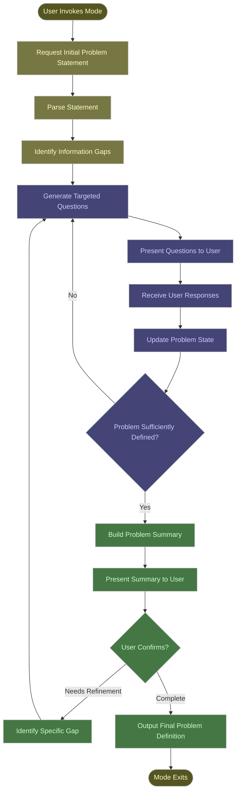

# Plan: Problem Identification Claude Mode

## Decision Log

### 2026-02-04: Pivot from Skill to Custom Mode

**Decision:** Problem identifier should be implemented as a custom mode, not a skill.

**Rationale:**
- Problem definition is a prerequisite phase before planning, not an invocable procedure
- Requires persistent behavioural state with tool restrictions (like plan mode)
- Changes Claude's fundamental operating constraints (cannot suggest solutions)
- Should produce a problem definition document before returning to normal conversation
- Part of a multi-step workflow: Problem Definition → [intermediate steps] → Planning → Step Generation → Implementation

**Impact:**
- Removed `.devcontainer/.claude/skills/problem-identifier.skill.md` (incorrectly created)
- This plan now serves as source of truth for problem definition mode design
- Implementation approach will be determined through exploration of custom mode architecture

### 2026-02-04: Rule Application Mechanism - Critical Observation

**Observation:** Rule path filtering through frontmatter is unreliable for ensuring consistent behaviour.

**Key Findings:**
1. **Path-based filtering applies to file edits only**: The `paths:` frontmatter in rule files only activates rules when editing files matching those patterns, not for general instructions or behaviour
2. **Rules require explicit inclusion**: Rules are only included in context when:
   - Explicitly referenced in central instruction files, OR
   - A file matching the rule's `paths:` pattern is being edited
3. **Context loss occurs**: Even when rules are called out centrally, they are subject to context window limitations and may be dropped during long conversations
4. **Behaviour inconsistency**: Rules applied through path filtering or central inclusion do not reliably modify Claude's behaviour across all operations

**Design Implication:**
Rather than relying on automatic rule application through path filtering or central instruction files, rules must be explicitly embedded in prompts, skills, and agents where their constraints are required. This ensures:
- Rules are present in context when needed
- Constraints are enforced during specific operations
- Behaviour modifications are predictable and consistent
- Context budget is managed through selective embedding

**Referenced Standards:**
- `.devcontainer/.claude/rules/rule-embedding.md` - Governs selective rule embedding strategy
- `.devcontainer/.github/instructions/prompt-files.instructions.md` - Defines prompt structure with embedded rules
- `.devcontainer/.github/instructions/step-files.instructions.md` - Requires complete rule verbatim inclusion

**This observation applies to multiple AI tools, not just Claude Code.**

## Overview

Create a custom mode for Claude Code that guides users through systematic problem identification using interactive questioning. The mode employs a structured approach to help users articulate and define problems clearly before attempting solutions.

### Mode Persona and Constraints

**Business Analyst Persona:**
- The mode operates with a Business Analyst mindset
- Assumes no technical knowledge of the problem domain
- Focuses on understanding business needs, not technical implementations
- Uses non-technical language accessible to all stakeholders

**Problem Definition Focus:**
- The mode's ONLY responsibility is problem definition
- The mode MUST NOT suggest solutions or implementation approaches
- The mode MUST NOT make assumptions about how problems should be solved
- Unless explicitly requested by the user, the mode stays focused on "what" not "how"

**Documentation-First Requirement:**
- The mode MUST observe `.devcontainer/.claude/rules/documentation-first.md`
- No assumptions or speculation by the LLM
- All knowledge must come from verified documentation or direct user input
- When uncertain, the mode MUST ask rather than assume

## Mode Architecture

### Core Components

1. **Mode Entry Point** (`problem-identifier.mode.md`)
   - Mode definition file following Claude Agent SDK conventions
   - Defines mode name, description, and entry behaviour
   - Located in `.claude/modes/` or project modes directory

2. **Workflow Engine**
   - Question generation based on current understanding
   - Response analysis to identify gaps
   - Termination detection when problem is sufficiently defined

3. **Problem State Management**
   - Structured storage of problem components
   - Incremental refinement through questioning rounds
   - Final problem statement synthesis

## Workflow Description

### Phase 1: Initial Problem Statement

The mode begins by requesting an initial problem description from the user. This serves as the foundation for subsequent questioning.

**Process:**
1. Prompt user for initial problem statement
2. Parse statement to identify explicit elements
3. Identify implicit assumptions and gaps
4. Generate targeted questions for Phase 2

### Phase 2: Iterative Refinement

The mode enters a questioning loop, asking focused questions to clarify and expand the problem definition.

**Question Categories (Business Analyst Focus):**
- **Context**: Business environment, stakeholders, organisational constraints
- **Symptoms**: Observable behaviours, outcomes, user reports (no technical diagnostics assumed)
- **Impact**: Affected users/business units, severity, frequency, business consequences
- **Goals**: Desired business outcomes, success criteria from user perspective
- **Constraints**: Resources, time, budget, organisational limitations (not technical constraints unless user specifies)

**Process per iteration:**
1. Present 1-3 targeted questions based on identified gaps
2. Receive user responses
3. Update problem state with new information
4. Assess completeness of problem definition
5. Continue or proceed to Phase 3

### Phase 3: Problem Summary and Confirmation

Once the problem appears sufficiently defined, the mode presents a structured summary for user confirmation.

**Summary Structure:**
- Problem statement (1-2 sentences)
- Context and environment
- Symptoms and observable issues
- Impact and affected parties
- Desired outcome
- Known constraints

**User actions:**
- Confirm problem definition is complete
- Request additional clarification on specific aspects
- Restart with refined initial statement

## Workflow Diagram



## State Management Structure

### Problem State Object

```json
{
  "initialStatement": "string",
  "context": {
    "businessEnvironment": "string (department, business area, organisational context)",
    "stakeholders": ["string (roles/departments, not individuals)"],
    "organisationalConstraints": ["string (time, budget, resources)"]
  },
  "symptoms": ["string (observable outcomes, user reports, business impacts)"],
  "impact": {
    "affectedParties": ["string (business units, user groups)"],
    "severityFromBusinessPerspective": "low|medium|high|critical",
    "frequency": "string",
    "businessConsequences": ["string (revenue, productivity, reputation)"]
  },
  "goals": {
    "desiredBusinessOutcome": "string (not technical solution)",
    "successCriteriaFromUserPerspective": ["string (measurable business outcomes)"]
  },
  "questionsAsked": ["string"],
  "iterationCount": "number",
  "documentationSources": ["string (any verified sources referenced)"],
  "ruleEmbeddingHistory": [
    {
      "iteration": "number",
      "operationType": "question|document|diagram",
      "rulesEmbedded": ["documentation-first:consultation", "documentation-first:no-assumptions"],
      "estimatedTokens": "number"
    }
  ]
}
```

**Note:** All fields capture business-focused information. Technical details are only included if explicitly provided by the user, never assumed by the LLM. The `ruleEmbeddingHistory` tracks which rules were embedded in which prompts for debugging and context management.

## Question Generation Strategy

### Gap Analysis

The mode analyses the current problem state to identify missing information:

1. **Required Information Checklist:**
   - Initial problem statement: ✓/✗
   - Context established: ✓/✗
   - Symptoms documented: ✓/✗
   - Impact quantified: ✓/✗
   - Goals articulated: ✓/✗
   - Constraints identified: ✓/✗

2. **Priority Ranking:**
   - High priority: Symptoms, context, goals
   - Medium priority: Impact, constraints
   - Low priority: Additional environmental details

3. **Question Formulation:**
   - Generate 1-3 questions per iteration
   - Focus on highest-priority gaps
   - Use open-ended questions to encourage detail
   - Avoid yes/no questions unless seeking confirmation

### Sample Questions by Category (Business Analyst Perspective)

**Context Questions:**
- "What business area or department does this problem occur in?"
- "Who are the key stakeholders affected by or involved with this situation?"
- "What organisational or resource constraints should we be aware of?"

**Symptom Questions:**
- "What observable outcomes or behaviours are concerning?"
- "Can you describe what users or staff are experiencing?"
- "When did this situation first become noticeable?"

**Impact Questions:**
- "How many people or business units are affected?"
- "What are the business consequences of this situation?"
- "How often does this occur?"

**Goal Questions:**
- "What business outcome would you like to achieve?"
- "How will you know when the problem no longer exists?"
- "What does success look like from your perspective?"

**Note:** Questions avoid technical language, solution assumptions, and implementation details. The focus is on understanding the business problem, not how it might be solved.

## Termination Criteria

### Sufficient Definition Indicators

The mode determines a problem is sufficiently defined when:

1. **Core elements present:**
   - Clear problem statement (business-focused, non-technical)
   - Documented symptoms (observable outcomes)
   - Articulated desired business outcome (not implementation approach)

2. **Quality thresholds met:**
   - Context provides adequate business understanding
   - Impact is quantified or qualified from business perspective
   - Goals include measurable success criteria
   - No solution assumptions or implementation details included

3. **User satisfaction:**
   - User indicates readiness to proceed
   - No additional questions from user
   - Confirmation of summary accuracy

4. **Documentation-first compliance:**
   - All information verified through user input
   - No assumptions or speculation included
   - Any uncertainties explicitly stated

### Maximum Iteration Limit

To prevent infinite loops, the mode enforces:
- Maximum 10 questioning iterations
- Warning at iteration 8 that limit approaches
- Forced termination with best-effort summary at iteration 10

## Mode File Structure

### File: `problem-identifier.mode.md`

```markdown
---
name: problem-identifier
description: Guide users through systematic problem identification
version: 1.0.0
---

# Problem Identifier Mode

## Purpose

Help users articulate and define problems clearly through structured questioning before attempting solutions.

## Persona and Constraints

**Business Analyst Perspective:**
- Assume no technical knowledge of problem domain
- Use non-technical, business-focused language
- Focus on understanding business needs and impacts

**Problem Definition Only:**
- MUST NOT suggest solutions or implementations
- MUST NOT make assumptions about how problems should be solved
- Focus exclusively on defining "what" not "how"

**Documentation-First Approach:**
- All information must come from verified sources or direct user input
- No assumptions or speculation permitted
- When uncertain, ask rather than assume

## Entry Behaviour

When invoked, request initial problem statement from user and begin iterative refinement process.

## Workflow

1. Collect initial problem statement
2. Analyse statement for gaps (business perspective)
3. Generate targeted questions (avoiding technical assumptions)
4. Iterate until problem is sufficiently defined
5. Present summary for confirmation (problem only, no solutions)
6. Output final problem definition

## Exit Conditions

- User confirms problem definition is complete
- Maximum iteration limit reached (10)
- User explicitly requests mode exit
```

## Rule Embedding Requirements

### Selective Rule Embedding Strategy

The mode MUST follow `.devcontainer/.claude/rules/rule-embedding.md` for all prompt generation.

**Core Principle:**
- Embed ONLY rules relevant to the current task
- Prevents context flooding whilst maintaining quality standards
- Embed complete sections of selected rules (no abbreviation)
- Track which rules are embedded in which prompts

### Rule Selection by Task Type

**Question Generation (No Document Output):**
- Embed: Documentation-first consultation and no-assumptions sections
- Omit: Documentation standards, Mermaid rules (not generating documents/diagrams)

**Problem Definition Document Generation:**
- Embed: Documentation standards (UK English, tone, headings)
- Embed: Documentation-first sections (if research required)
- Omit: Mermaid rules (no diagrams in document)

**Workflow Diagram Generation:**
- Embed: Mermaid syntax basics and layout requirements
- Embed: Colour schemes ONLY if diagram has nested structures (phases, stages, layers)
- Embed: Documentation standards (UK English, tone) for any labels/descriptions
- Omit: Colour schemes for simple flat diagrams

**Problem Summary with Diagram:**
- Embed: Documentation standards (complete)
- Embed: Mermaid rules (syntax, layout, colour schemes if nested)
- Embed: Documentation-first sections (if any claims require verification)

### Dynamic Rule Selection Implementation

The mode SHOULD implement logic to determine requirements:

```
For each prompt:
1. Identify operation type (question | document | diagram | mixed)
2. Assess complexity (simple | moderate | complex)
3. Check for nesting/hierarchy (for diagrams)
4. Select minimum required rule sections
5. Embed complete selected sections verbatim
6. Track embedded rules in state
```

### Example Prompt Structures

**Example 1: Question Generation**

````markdown
You are a Business Analyst helping define a problem. Do not suggest solutions.

---

# Embedded Rules

## Documentation-First Response Requirements (from documentation-first.md)

**MUST:**
- Explicitly state when information cannot be verified through documentation
- Say "I don't know" or "I cannot verify this information" when uncertain
- Ask for clarification rather than assuming user intent or requirements

**MUST NOT:**
- Speculate or provide unverified answers
- Make assumptions about what the user means
- Guess at technical details or implementations

---

# Task

Based on user input: "[statement]"

Generate 1-3 targeted questions about business context.
````

**Example 2: Nested Workflow Diagram**

````markdown
You are generating a workflow diagram with three distinct phases.

---

# Embedded Rules

## Mermaid Diagram Requirements (from mermaid-diagrams.md)

**MUST:**
- Use `graph TB` (top-to-bottom) layout
- Use subgraphs to group components within same layer
- Apply hierarchical colour scheme for nested structures

[Complete colour scheme definitions...]
[Complete syntax requirements...]

## Documentation Standards (from documentation-standards.md)

**MUST:**
- Use UK spelling throughout
- Use factual, technical language only

---

# Task

Generate diagram showing problem identification workflow with three phases and nested activities.
````

## Implementation Considerations

### Error Handling

**User provides insufficient responses:**
- Rephrase question with examples
- Break complex questions into smaller parts
- Offer multiple choice options to guide thinking

**User becomes frustrated:**
- Offer option to skip to summary with current information
- Provide reassurance about process value
- Allow user to exit mode gracefully

**Circular questioning detected:**
- Track previously asked questions
- Avoid rephrasing same question
- Adjust question generation strategy

**User asks about solutions or implementations:**
- Politely redirect: "My role is to help define the problem clearly. Once we have a complete problem definition, you can work on solutions separately."
- Acknowledge the question shows good thinking
- Refocus on completing problem definition first
- Do not provide solution suggestions even if explicitly asked

### User Experience Optimisations

1. **Progress indicators:**
   - Show current iteration number
   - Indicate estimated completeness (e.g., "Problem is 60% defined")
   - Provide option to view current problem state

2. **Flexibility:**
   - Allow user to provide information proactively
   - Accept non-linear responses (user answers unasked questions)
   - Support "I don't know" responses with graceful handling

3. **Clarity:**
   - Use plain language, avoid jargon
   - Provide examples when helpful
   - Summarise user input to confirm understanding

## Integration with Claude Agent SDK

### Mode Registration

The mode must be discoverable by Claude Code through:
- Placement in `.claude/modes/` directory
- Proper frontmatter with name and description
- Following `.mode.md` naming convention

### Tool Usage Within Mode

The mode may use:
- `AskUserQuestion` for structured questioning
- Internal state management (no persistent storage required)
- Text parsing and analysis capabilities

### Mode Exit Behaviour

Upon completion, the mode should:
- Return control to main conversation
- Optionally output problem definition to file
- Make problem state available for subsequent tasks

## Testing Strategy

### Test Scenarios

1. **Complete problem definition:**
   - User provides comprehensive initial statement
   - Mode confirms with minimal questions
   - Summary accurately reflects input

2. **Vague initial statement:**
   - User provides minimal detail
   - Mode successfully elicits necessary information
   - Problem becomes well-defined through iteration

3. **User uncertainty:**
   - User unsure about constraints or goals
   - Mode adapts questioning strategy
   - Summary captures uncertainty appropriately

4. **Maximum iterations:**
   - User provides limited responses across iterations
   - Mode reaches iteration limit
   - Best-effort summary generated

### Success Criteria

- Problem definition includes all core elements (statement, symptoms, goals)
- User confirms summary accuracy
- Mode completes within reasonable iteration count (typically 3-7)
- No circular or repetitive questioning
- Graceful handling of edge cases

## Future Enhancements

### Potential Additions

1. **Problem classification:**
   - Categorise problems by type (technical, organisational, process)
   - Adjust questioning strategy based on category

2. **Template support:**
   - Predefined question sets for common problem domains
   - Domain-specific terminology and frameworks

3. **Collaboration features:**
   - Multi-user problem definition
   - Stakeholder perspective gathering
   - Consensus building on problem statement

4. **Integration with solution tools:**
   - Automatic transition to solution generation mode
   - Problem-solution traceability
   - Solution validation against original problem definition

## Conclusion

This problem identification mode provides a structured, interactive approach to helping users clearly articulate problems before attempting solutions. Operating with a Business Analyst persona, the mode focuses exclusively on problem definition without making technical assumptions or suggesting implementations.

**Key Design Principles:**

1. **Business-Focused:** Non-technical language, business outcome orientation
2. **Problem-Only:** No solution suggestions or implementation assumptions
3. **Documentation-First:** All information verified through user input or documentation
4. **Rule Embedding:** Critical rules embedded in all prompts to prevent context flooding
5. **Iterative Refinement:** Structured questioning with clear termination criteria
6. **User-Centric:** Flexible, patient approach that respects user expertise

Through iterative questioning, state management, and strict adherence to documentation-first principles, the mode ensures comprehensive problem definition whilst maintaining flexibility and user satisfaction.
